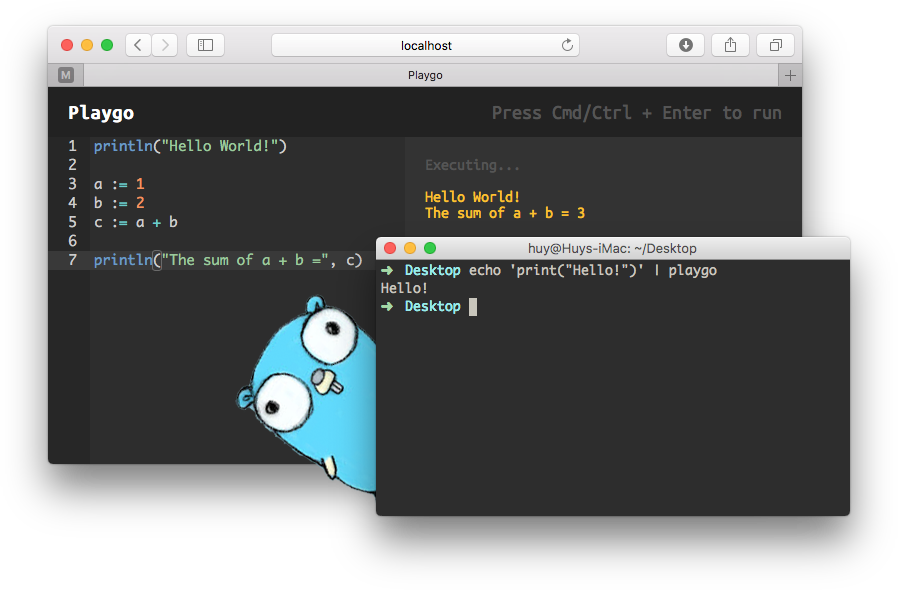
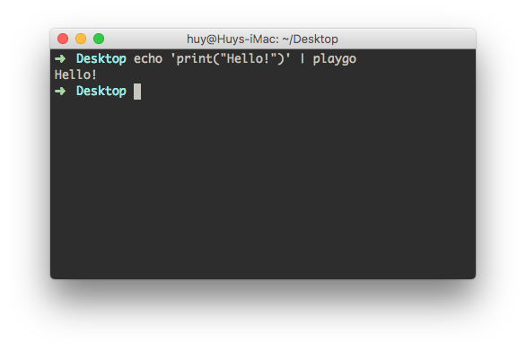
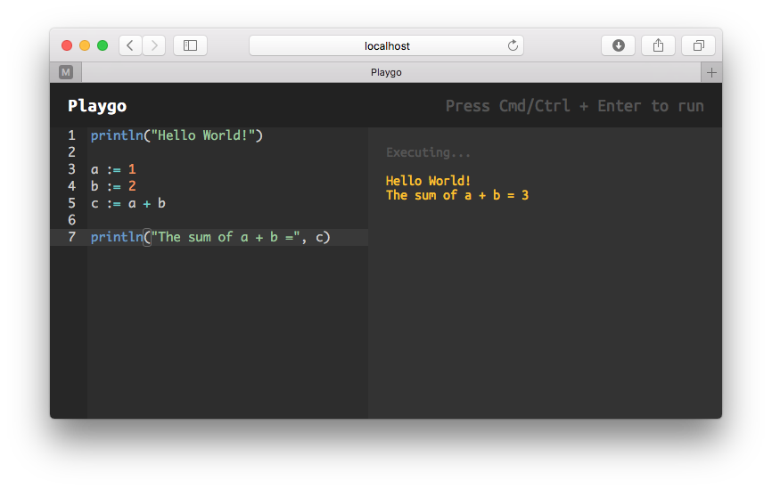

# Playgo - a real playful Golang playground



## Why use this?

Because:

- The official Playground's UI sucks
- This one run locally with no need of container/docker
- Smaller code-base, easier to customize
- Use it the way you want (cli mode and web mode)
- Forget the code format, just type the code anyway you want
- ... (add more awesome stuff here) ...

## How to install?

Stand-alone installer will be supported later. For now, you have to build it yourself.

Get the source code, and run:

```
make install
```

You will be prompted to enter password, in order to install `playgo` to `/usr/local/bin`.

## What is this?

This is the simple version of Go Playground. It run locally with no container needed.

There are *2* modes available:

### Command-line mode



Also called as `cli` mode. In this mode, the playground will read the code from `os.Stdin` and execute it. This enable the ability to integrate `playgo` with other editors such as **vim**, **sublime**, **atom**,...

Usage:

```
echo 'print("Hello, do some math, 1 + 1 = ", 1 + 1)' | playgo
```

or

```
cat something.txt | playgo
```

### Web mode



If you don't like using `cli` mode, you can use the web IDE by run the following command:

```
playgo -mode=web
```

The web IDE will be started at [http://localhost:3000](http://localhost:3000) by default.

You can change the port by:

```
PORT=8080 playgo -mode=web
```

## License
This project is licensed under the terms of the **MIT** license.

## For Developers

It would be nice if you want to contribute to this project. I really need your help, there are a lot of things to do.

Feel free to create a pull request or make an issue to report bugs/request new features. You can see the list of things to do below.

:bow:

## To Do:

- Parse the code with `AST`
- Fully Support `import`
- Support `func`
- Support `channel` (real problem is: streaming output)
- Execute code in containers or isolated environment for more security?
- Create a command line code editor / or a VIM plugin?
- Autocomplete for web IDE
